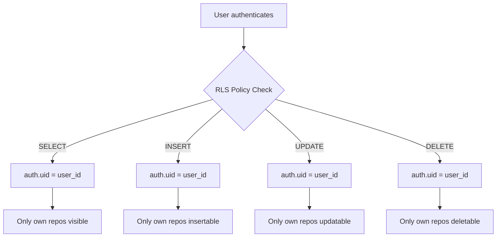
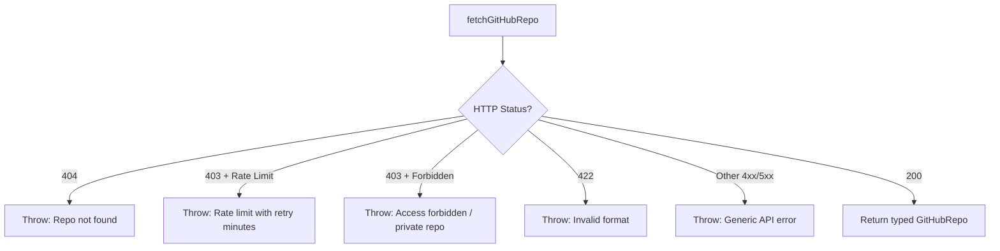
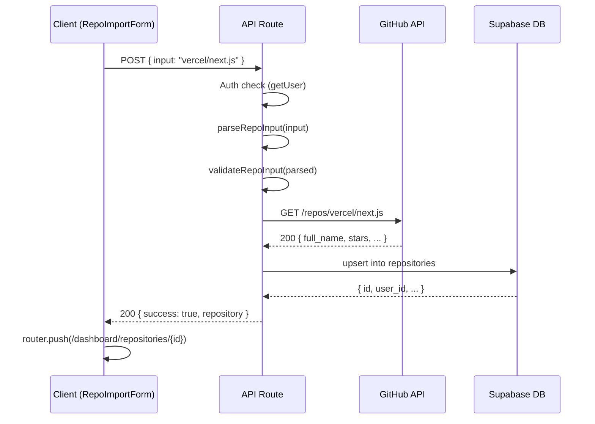
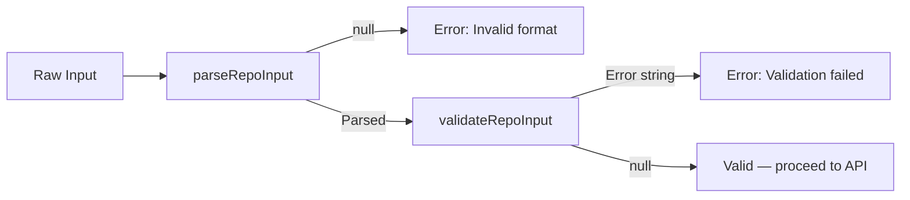
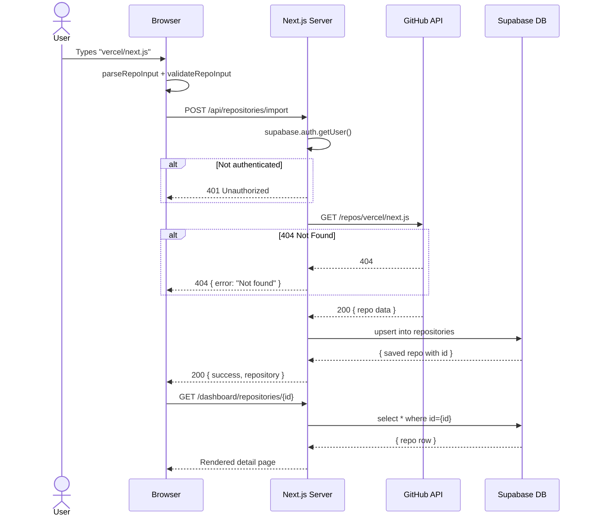
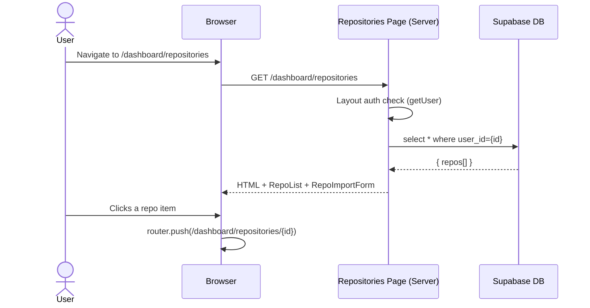

# RepoLens AI — Phase 2: GitHub Repository Integration

## Developer Learning Document

---

## Table of Contents

1. [Phase Overview](#1-phase-overview)
2. [Architecture Decisions](#2-architecture-decisions)
3. [Database Design — Why a New Table](#3-database-design--why-a-new-table)
4. [File Structure — Phase 2 Additions](#4-file-structure--phase-2-additions)
5. [GitHub API Integration (`src/lib/github.ts`)](#5-github-api-integration)
6. [Supabase Repository CRUD (`src/lib/supabase/repositories.ts`)](#6-supabase-repository-crud)
7. [API Routes — Server-Side Auth Guard + Business Logic](#7-api-routes)
8. [Repository List Page (`/dashboard/repositories`)](#8-repository-list-page)
9. [Repository Detail Page (`/dashboard/repositories/[id]`)](#9-repository-detail-page)
10. [Input Parsing & Validation Strategy](#10-input-parsing--validation-strategy)
11. [Error Handling — GitHub API, Rate Limits, Missing Table](#11-error-handling)
12. [Data Flow Diagrams](#12-data-flow-diagrams)
13. [Security Considerations](#13-security-considerations)
14. [Key Design Decisions & Trade-offs](#14-key-design-decisions--trade-offs)
15. [Phase 2 Interview Questions](#15-phase-2-interview-questions)
16. [Revision Notes](#16-revision-notes)

---

## 1. Phase Overview

Phase 2 adds GitHub Repository Integration to RepoLens AI. The scope covers:

- **Repository Import**: Accept `owner/repo` or full GitHub URL, validate, and fetch metadata
- **GitHub REST API**: Fetch 15+ metadata fields (stars, forks, language, topics, license, etc.)
- **Repository Dashboard**: Display all fetched metadata in a clean detail view
- **Persistence**: Save imported repos to a new `repositories` table in Supabase with RLS
- **Repository History**: List all previously imported repos with import/view dates

**What was NOT built** (intentionally out of scope): AI, LLM, RAG, embeddings, commit history, timeline, semantic search — these belong to later phases.

---

## 2. Architecture Decisions

### Server Components vs Client Components

| File | Type | Why |
|------|------|-----|
| `/dashboard/repositories/page.tsx` | Server Component | Fetches user's repos from Supabase server-side — no client JS needed for initial render |
| `/dashboard/repositories/[id]/page.tsx` | Server Component | Fetches single repo from DB server-side, passes to client for interactivity |
| `repo-import-form.tsx` | Client Component | Needs `useState` for input, loading, error states and `useRouter` for navigation |
| `repo-list.tsx` | Client Component | Needs `useRouter` for navigation, `useState` for delete loading state |
| `repo-detail-view.tsx` | Client Component | Could be Server Component but kept as client for consistency and future interactivity |

### API Routes vs Direct Server Components

API routes were used for mutations (import, delete) because:
- Server Components can't handle form submissions
- API routes provide clean separation: auth check → business logic → response
- Client components call these via `fetch()` — same pattern as Phase 1's logout

### No Middleware

Auth is handled in the `(dashboard)/layout.tsx` via `getUser()` (established in Phase 1). No new middleware was added. API routes independently verify auth via `supabase.auth.getUser()`.

---

## 3. Database Design — Why a New Table

### Existing Tables

After Phase 1, the Supabase project only has:
- `auth.users` — Managed by Supabase Auth (cannot be modified with custom columns)

### Why `repositories` Table is Required

The `auth.users` table stores authentication data (email, password hash, metadata). It cannot store repository data because:
1. Supabase manages this table — adding custom columns risks breaking auth
2. A user can import multiple repos (one-to-many relationship)
3. Repository data (stars, forks, topics) has nothing to do with user identity

### Schema

```sql
CREATE TABLE public.repositories (
  id              UUID DEFAULT gen_random_uuid() PRIMARY KEY,
  user_id         UUID NOT NULL REFERENCES auth.users(id) ON DELETE CASCADE,
  repo_id         BIGINT NOT NULL,            -- GitHub's numeric repo ID
  full_name       TEXT NOT NULL,              -- "owner/repo"
  name            TEXT NOT NULL,              -- "repo"
  owner_login     TEXT NOT NULL,              -- "owner"
  owner_avatar    TEXT,                       -- Avatar URL
  description     TEXT,
  html_url        TEXT NOT NULL,
  stars           INTEGER DEFAULT 0,
  forks           INTEGER DEFAULT 0,
  watchers        INTEGER DEFAULT 0,
  open_issues     INTEGER DEFAULT 0,
  language        TEXT,
  topics          TEXT[] DEFAULT '{}',
  license         TEXT,                       -- SPDX ID
  default_branch  TEXT DEFAULT 'main',
  created_at      TIMESTAMPTZ NOT NULL DEFAULT now(),   -- Import timestamp
  updated_at      TIMESTAMPTZ NOT NULL DEFAULT now(),   -- Last viewed
  github_created_at TIMESTAMPTZ,             -- From GitHub API
  github_updated_at TIMESTAMPTZ,             -- From GitHub API
  UNIQUE(user_id, repo_id)                   -- No duplicate imports
);
```

### RLS Policies



### Auto-update Trigger

A `handle_updated_at()` trigger automatically sets `updated_at = now()` on any row update. This is used for "last viewed" tracking — when a user views a repo detail, the `touchRepository()` function updates this field.

---

## 4. File Structure — Phase 2 Additions

```
src/
├── lib/
│   ├── github.ts                          # NEW — GitHub API integration
│   └── supabase/
│       ├── client.ts                      # Phase 1 (cookie-based browser client)
│       ├── server.ts                      # Phase 1 (server-side client)
│       ├── middleware.ts                   # Phase 1 (unused helper)
│       └── repositories.ts                # NEW — Supabase repositories CRUD
├── app/
│   ├── api/
│   │   ├── route.ts                       # Phase 1 placeholder
│   │   └── repositories/
│   │       ├── route.ts                   # NEW — GET list repos
│   │       ├── import/
│   │       │   └── route.ts               # NEW — POST import repo
│   │       └── [id]/
│   │           └── route.ts               # NEW — GET/DELETE single repo
│   └── (dashboard)/
│       └── dashboard/
│           ├── page.tsx                   # UPDATED — passes repoCount
│           └── repositories/
│               ├── page.tsx               # NEW — repo list + import form
│               └── [id]/
│                   └── page.tsx           # NEW — repo detail view
├── components/
│   ├── dashboard/
│   │   ├── dashboard-content.tsx          # UPDATED — repoCount, nav link
│   │   └── feature-card.tsx               # UPDATED — href, status props
│   └── repositories/
│       ├── repo-import-form.tsx           # NEW — import input + submit
│       ├── repo-list.tsx                  # NEW — repo history list
│       └── repo-detail-view.tsx           # NEW — repo metadata display
scripts/
    └── create-repositories-table.sql       # NEW — DB setup SQL
```

---

## 5. GitHub API Integration

### File: `src/lib/github.ts`

This module handles all GitHub REST API communication.

### Key Exports

| Export | Type | Purpose |
|--------|------|---------|
| `GitHubRepo` | Interface | TypeScript type matching GitHub API response shape |
| `ParsedRepoInput` | Interface | `{ owner: string; repo: string }` |
| `parseRepoInput(input)` | Function | Parses URL or `owner/repo` string |
| `validateRepoInput(parsed)` | Function | Validates owner/repo name rules |
| `fetchGitHubRepo(owner, repo)` | Function | Calls GitHub REST API, returns typed data |
| `GitHubAPIError` | Class | Custom error with `status`, `isRateLimit`, `retryAfter` |
| `formatCount(num)` | Function | Formats numbers as `1.2K`, `3.5M` |

### Input Parsing Logic

```typescript
// Accepts both formats:
parseRepoInput("vercel/next.js")        // → { owner: "vercel", repo: "next.js" }
parseRepoInput("https://github.com/vercel/next.js")  // → same
parseRepoInput("https://github.com/vercel/next.js/tree/canary")  // → same (trims path)
parseRepoInput("invalid-input")          // → null
```

Two regex patterns are tried in sequence:
1. Full URL: `^https?:\/\/github\.com\/([^/]+)\/([^/]+?)(?:\/.*)?$`
2. Simple format: `^([^/]+)\/([^/]+)$`

### GitHub API Call

The function uses the **unauthenticated** GitHub REST API endpoint:
```
GET https://api.github.com/repos/{owner}/{repo}
```

This provides 60 requests/hour per IP, which is sufficient for a Phase 2 demo. No GitHub token is stored or required.

### Error Handling Strategy



The `GitHubAPIError` class carries structured data:
```typescript
class GitHubAPIError extends Error {
  status: number;       // HTTP status code
  isRateLimit: boolean; // True if 403 + X-RateLimit-Remaining: 0
  retryAfter?: number;  // Seconds until rate limit resets
}
```

---

## 6. Supabase Repository CRUD

### File: `src/lib/supabase/repositories.ts`

This module provides a typed data access layer between API routes and Supabase.

### Key Functions

| Function | Parameters | Returns | Purpose |
|----------|-----------|---------|---------|
| `githubToDbRow()` | `GitHubRepo, userId` | DB row object | Maps GitHub API response to DB column shape |
| `saveRepository()` | `userId, GitHubRepo` | `DbRepository` | Upserts repo (prevents duplicate imports) |
| `getUserRepositories()` | `userId` | `DbRepository[]` | Lists all repos for a user, newest first |
| `getRepositoryById()` | `repoId, userId` | `DbRepository \| null` | Fetches single repo (scoped to user) |
| `deleteRepository()` | `repoId, userId` | `void` | Deletes a repo (scoped to user) |
| `touchRepository()` | `repoId, userId` | `void` | Updates `updated_at` for "last viewed" |

### Data Mapping: GitHub API → Database

The `githubToDbRow()` function maps GitHub's nested response to flat DB columns:

```
GitHub API                          →  Database Column
─────────────────────────────────────────────────────
id                                  →  repo_id
full_name                           →  full_name
name                                →  name
owner.login                         →  owner_login
owner.avatar_url                    →  owner_avatar
description                         →  description
html_url                            →  html_url
stargazers_count                    →  stars
forks_count                         →  forks
watchers_count                      →  watchers
open_issues_count                   →  open_issues
language                            →  language
topics                              →  topics (TEXT[])
license?.spdx_id                    →  license
default_branch                      →  default_branch
created_at                          →  github_created_at
updated_at                          →  github_updated_at
```

### Upsert Strategy

The `saveRepository()` function uses Supabase's `.upsert()` with `onConflict: "user_id,repo_id"`. This means:
- First import: inserts a new row
- Re-importing the same repo: updates existing row with fresh GitHub data
- No duplicate entries possible

### Graceful Degradation

If the `repositories` table doesn't exist (user hasn't run the SQL setup), functions return empty results or throw a recognizable `REPO_TABLE_MISSING` error that the API route catches and returns as a helpful 503 message.

---

## 7. API Routes

### `POST /api/repositories/import`

**Flow:**


**Error responses:**
- `400` — Invalid input format or validation failure
- `401` — Not authenticated
- `404` — GitHub repo not found
- `403` — Rate limited or forbidden
- `503` — Table not set up (includes `setupRequired: true` flag)
- `500` — Unexpected error

### `GET /api/repositories`

Returns `{ repositories: DbRepository[] }` for the authenticated user.

### `GET /api/repositories/[id]`

Returns `{ repository: DbRepository }` for a single repo. Also calls `touchRepository()` to update the "last viewed" timestamp.

### `DELETE /api/repositories/[id]`

Deletes a repo. Returns `{ success: true }`.

---

## 8. Repository List Page

### Route: `/dashboard/repositories`

**Server Component** — fetches data server-side:

```typescript
const repositories = await getUserRepositories(user.id);
```

Renders two child components:
1. **`RepoImportForm`** (client) — input field + submit button
2. **`RepoList`** (client) — list of imported repos or empty state

### Import Form Behavior

- User types `owner/repo` or URL
- Client validates non-empty input
- On submit, calls `POST /api/repositories/import`
- On success: navigates to `/dashboard/repositories/{id}` (detail page)
- On error: displays error below input with `AlertCircle` icon

### List Item Display

Each repo shows:
- Owner avatar (fetched from GitHub, stored in DB)
- Full name (`owner/repo`)
- Description (truncated to 80 chars)
- Language, stars, forks counts
- Import date and last viewed date
- GitHub link (external) and delete button (appear on hover)

---

## 9. Repository Detail Page

### Route: `/dashboard/repositories/[id]`

**Server Component** — fetches single repo from DB, renders `RepoDetailView`.

### Metadata Displayed

**Stats Row** (4-column): Stars, Forks, Watchers, Open Issues

**Metadata Grid** (auto-fill): Default Branch, Language, License, Created on GitHub, Last Updated on GitHub

**Topics Section**: Rendered as pill-shaped tags if any exist

**GitHub Button**: External link to the actual GitHub repository

### Why Not Fetch Live from GitHub?

The detail page reads from the database (not GitHub API) because:
- Faster — no external API call
- Works offline — data is persisted
- Consistent — snapshot of data at import time
- Rate limit friendly — no extra API calls

Users can re-import a repo to refresh the data.

---

## 10. Input Parsing & Validation Strategy

### Two-Stage Validation



### Stage 1: Parsing (`parseRepoInput`)

- Tries URL regex first, then simple `owner/repo` regex
- Returns `null` if neither matches
- Trims whitespace and handles trailing paths in URLs

### Stage 2: Validation (`validateRepoInput`)

- Checks owner/repo are non-empty
- Enforces length limits (owner ≤ 39, repo ≤ 100)
- Validates character set: only `a-zA-Z0-9._-` allowed
- Returns error string or `null` if valid

### Why Validate Before API Call?

- Avoids unnecessary network requests for obviously invalid input
- Provides instant feedback (no loading spinner needed)
- Reduces GitHub API rate limit consumption
- Matches GitHub's actual username/repo naming rules

---

## 11. Error Handling

### Three Error Categories

#### 1. Input Errors (Client-Side)
- Empty input → immediate feedback
- Invalid format → immediate feedback
- Validation failure → immediate feedback

#### 2. GitHub API Errors (Server-Side)
- `404` → "Repository not found" — repo doesn't exist or is private
- `403` + rate limit → "Rate limit exceeded. Try again in X minutes."
- `403` + forbidden → "Access forbidden" — likely private repo
- `422` → "Invalid format" — shouldn't happen after client validation
- Network failure → "Network error. Check your connection."

#### 3. Database Errors (Server-Side)
- Table missing (`42P01`) → "Table not set up. Run SQL in scripts/create-repositories-table.sql"
- Insert conflict → Handled by upsert (not an error)
- RLS denial → Returns empty results (user not authenticated properly)

### Rate Limit Handling

The GitHub unauthenticated API allows 60 requests/hour. The import API:
- Reads `X-RateLimit-Remaining` header to detect rate limits
- Reads `X-RateLimit-Reset` header to calculate retry time
- Returns `isRateLimit: true` and `retryAfter` in the response
- Shows human-readable "try again in X minutes" message

---

## 12. Data Flow Diagrams

### Complete Import Flow



### Repository List Flow



---

## 13. Security Considerations

### Authentication

- Every API route calls `supabase.auth.getUser()` first
- Unauthenticated requests get `401` immediately
- Server Components under `(dashboard)/layout.tsx` redirect to `/` if no user

### RLS (Row Level Security)

- All four SQL operations (SELECT, INSERT, UPDATE, DELETE) are scoped to `auth.uid() = user_id`
- Users can never see or modify another user's repositories
- Even if someone knows a repo UUID, they can't access it without being the owner

### Input Sanitization

- Owner/repo names validated against `a-zA-Z0-9._-` character set
- Length limits enforced (owner ≤ 39, repo ≤ 100)
- All values passed through `encodeURIComponent()` in API URLs
- No raw SQL — all DB operations use Supabase's parameterized queries

### No GitHub Token Storage

- Phase 2 uses unauthenticated GitHub API (60 req/hr)
- No personal access tokens are stored or transmitted
- This is intentional — token management belongs to a future "settings" phase

### Supabase Service Role Key

- Never exposed to the client (only in `.env.local`)
- Only used in server-side code (`src/lib/supabase/server.ts`)
- The browser client uses the anon key with RLS

---

## 14. Key Design Decisions & Trade-offs

### Decision 1: Server Components for Data Fetching

**Choice**: Pages use Server Components to fetch from Supabase directly.

**Trade-off**: More server load, but better UX — data is available immediately without loading spinners or client-side fetch waterfall.

### Decision 2: API Routes for Mutations

**Choice**: Import and delete operations go through API routes, not Server Actions.

**Reason**: API routes provide clear HTTP semantics (POST/DELETE), easier error handling with status codes, and separation from rendering logic.

### Decision 3: Upsert on Import

**Choice**: Re-importing the same repo updates the existing record instead of creating a duplicate.

**Trade-off**: Loses import history (can't see when a repo was first vs. last imported) but prevents clutter and confusing duplicates.

### Decision 4: Snapshot vs. Live Data

**Choice**: Repository detail shows DB snapshot, not live GitHub data.

**Reason**: Faster, works offline, no rate limit impact. Users can re-import to refresh.

### Decision 5: CSS-Only Styling (No shadcn/ui for Phase 2)

**Choice**: Repository pages use custom CSS classes in `globals.css` instead of shadcn components.

**Reason**: Phase 2 spec says "minimal styling only — functionality is the priority." Custom CSS is faster to write for specific layouts and avoids unnecessary component abstraction.

### Decision 6: No Prisma

**Choice**: Direct Supabase client queries instead of Prisma ORM.

**Reason**: The existing project has a `db.ts` with Prisma but no `schema.prisma` file — Prisma was scaffolded but never configured. Adding Prisma would require schema definition, migration setup, and potentially conflict with Supabase's own migration system. The Supabase JS client is sufficient and keeps the dependency count lower.

---

## 15. Phase 2 Interview Questions

### Q1: Why did you create a new `repositories` table instead of extending `auth.users`?
**A**: The `auth.users` table is managed by Supabase and should not be modified with custom columns. Additionally, the relationship is one-to-many (one user → many repos), which requires a separate table with a foreign key to `auth.users`.

### Q2: How does input parsing work for repository import?
**A**: Two-stage approach. First, `parseRepoInput()` tries to match either a full GitHub URL (`https://github.com/owner/repo`) or a simple `owner/repo` format using regex. Second, `validateRepoInput()` checks for empty values, length limits, and invalid characters before making any API call.

### Q3: Why use Server Components for the repository list page?
**A**: Server Components can directly access Supabase from the server without exposing API details to the client. This eliminates client-side loading states and reduces JavaScript bundle size. The data is available immediately on first paint.

### Q4: How do you handle GitHub API rate limits?
**A**: The `fetchGitHubRepo()` function checks for HTTP 403 with `X-RateLimit-Remaining: 0`. When detected, it reads `X-RateLimit-Reset` to calculate the wait time and throws a `GitHubAPIError` with `isRateLimit: true` and `retryAfter` in seconds. The client displays a human-readable message.

### Q5: What happens if a user tries to import the same repository twice?
**A**: The `saveRepository()` function uses Supabase's `.upsert()` with `onConflict: "user_id,repo_id"`. The first import creates the row; subsequent imports update the existing row with fresh GitHub data. A `UNIQUE(user_id, repo_id)` constraint enforces this at the database level.

### Q6: How does RLS protect repository data?
**A**: Four RLS policies ensure that every SQL operation (SELECT, INSERT, UPDATE, DELETE) checks `auth.uid() = user_id`. Even if someone discovers a repository's UUID, they cannot access it unless they're authenticated as the owner. The anon key + RLS provides row-level security without application-level checks.

### Q7: Why is the `updated_at` column important?
**A**: It tracks "last viewed" time. When a user opens a repository detail page, `touchRepository()` updates this timestamp. This lets the list page show which repos were recently viewed, helping users find their active projects quickly.

### Q8: Why not use Prisma for database operations?
**A**: The project has a Prisma client reference (`db.ts`) but no `schema.prisma` file — it was scaffolded but never configured. Setting up Prisma would require defining the entire schema, managing migrations, and potentially conflicting with Supabase's own migration system. The Supabase JS client provides type-safe queries with less overhead.

### Q9: What's the difference between `github_created_at` and `created_at`?
**A**: `created_at` is when the repository was imported into RepoLens AI (set by the database). `github_created_at` is when the repository was created on GitHub (from the GitHub API). These are different timestamps serving different purposes.

### Q10: How does the error boundary work for the missing table scenario?
**A**: If the `repositories` table doesn't exist, Supabase returns error code `42P01`. The `getUserRepositories()` function catches this and returns an empty array (graceful degradation — list shows "No repositories yet"). The `saveRepository()` function throws `REPO_TABLE_MISSING`, which the import API route catches and returns as a 503 with instructions to run the setup SQL.

### Q11: Why did you choose unauthenticated GitHub API over using a token?
**A**: Phase 2 is about core functionality. Using unauthenticated API (60 req/hr) avoids the complexity of token storage, user settings, and GitHub OAuth. A GitHub token integration can be added in a future phase when the rate limit becomes a real constraint.

### Q12: How does the `FeatureCard` component's `href` prop work?
**A**: When `href` is provided, the entire card is wrapped in a Next.js `<Link>` component, making it navigable. When absent, it renders as a plain `div`. The status also changes from "Planned" to "Available" (green dot) when `href` is present, giving visual feedback about which features are live.

### Q13: What's the purpose of the `DbRepository` interface vs `GitHubRepo`?
**A**: `GitHubRepo` represents the raw GitHub API response shape (nested `owner` object, `license` object). `DbRepository` is the flattened database row shape (scalar columns like `owner_login`, `license` as string). The `githubToDbRow()` function bridges between them.

### Q14: How would you handle private repositories in a future phase?
**A**: Would need GitHub OAuth to get an access token, store it encrypted in the database or in a secure session, and pass it in the `Authorization: Bearer {token}` header when calling the GitHub API. The `fetchGitHubRepo()` function would need a `token` parameter.

### Q15: Why does `touchRepository()` silently catch errors?
**A**: It's a non-critical side effect — updating the "last viewed" timestamp shouldn't block the page from rendering or cause an error message. If it fails (network blip, table locked), the user still sees the repository data. The error is logged to console for debugging.

### Q16: Explain the upsert strategy in detail.
**A**: Supabase's `.upsert(row, { onConflict: "user_id,repo_id" })` translates to SQL `INSERT ... ON CONFLICT (user_id, repo_id) DO UPDATE`. The `UNIQUE(user_id, repo_id)` constraint ensures at most one row per user-repo pair. On conflict, all columns in the row are updated with the new values, effectively refreshing the stored data.

### Q17: Why is the `RepoImportForm` a separate component from the repositories page?
**A**: Separation of concerns. The page is a Server Component that fetches data. The form is a Client Component that manages local state (input, loading, errors). They're composed together — the page passes no props to the form, keeping them loosely coupled.

### Q18: What would happen if the Supabase service role key leaked?
**A**: The service role key bypasses RLS, meaning anyone with it could read/write ALL users' data. That's why it's only in `.env.local` (server-side only) and never sent to the browser. The browser client uses the anon key, which is restricted by RLS policies.

### Q19: How does the delete confirmation work?
**A**: Uses the browser's native `confirm()` dialog. If the user confirms, a `DELETE /api/repositories/{id}` request is sent. On success, `router.refresh()` re-fetches the Server Component data, removing the deleted repo from the list without a full page reload.

### Q20: Why format numbers with K/M suffixes?
**A**: Popular repos have numbers like `125000` stars. Displaying raw numbers is hard to scan. `formatCount(125000)` → `"125.0K"` is instantly readable. This follows GitHub's own display convention.

---

## 16. Revision Notes

### What to Review Before Moving to Phase 3

1. **Run the SQL setup** — `scripts/create-repositories-table.sql` must be executed in Supabase SQL Editor before the import feature works
2. **Test with real repos** — Try importing `facebook/react`, `vercel/next.js`, `denoland/deno`
3. **Test error cases** — Invalid format, non-existent repo, private repo
4. **Verify RLS** — Create two accounts, import repos with each, confirm they can't see each other's repos
5. **Rate limit awareness** — Unauthenticated GitHub API allows 60 req/hr; plan for token-based auth in a future phase
6. **Dashboard link** — The "Repository Import" feature card on the dashboard now navigates to `/dashboard/repositories` and shows "Available" status

### Files Changed in Phase 2

| File | Change Type |
|------|-------------|
| `src/lib/github.ts` | **NEW** |
| `src/lib/supabase/repositories.ts` | **NEW** |
| `src/app/api/repositories/import/route.ts` | **NEW** |
| `src/app/api/repositories/route.ts` | **NEW** |
| `src/app/api/repositories/[id]/route.ts` | **NEW** |
| `src/app/(dashboard)/dashboard/repositories/page.tsx` | **NEW** |
| `src/app/(dashboard)/dashboard/repositories/[id]/page.tsx` | **NEW** |
| `src/components/repositories/repo-import-form.tsx` | **NEW** |
| `src/components/repositories/repo-list.tsx` | **NEW** |
| `src/components/repositories/repo-detail-view.tsx` | **NEW** |
| `scripts/create-repositories-table.sql` | **NEW** |
| `src/components/dashboard/dashboard-content.tsx` | **MODIFIED** (repoCount, nav link) |
| `src/components/dashboard/feature-card.tsx` | **MODIFIED** (href, status props) |
| `src/app/(dashboard)/dashboard/page.tsx` | **MODIFIED** (fetches repoCount) |
| `src/app/globals.css` | **MODIFIED** (repository page styles) |
| `package.json` | **MODIFIED** (added `pg` dependency) |